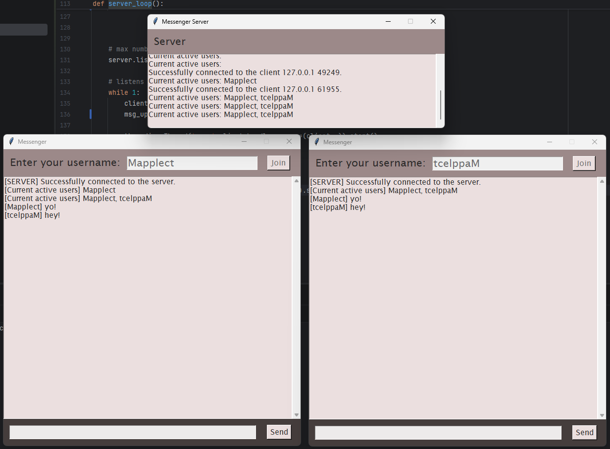

# Messenger
Messenger is a Python progam (strictly Windows) that acts as your typical messaging platform.
### 
## How does it work?
Messenger follows the typical flow of any messaging system. Simply, if you enter a text into any messaging platform, your computer (client) will take the text and turn it in to small, digestable packets that are sent over a socket connnection to the server. These packets are labeled accordingly so the server knows who to ship them to. These packets are then shipped to the recipient client (computer) where they are reassembled and turned into text that appears on the screen.
## Features
* End-to-End Encryption - Only the people actively communicating in the chat can see the content of the messages.
* Real-time Messaging - The usage of sockets allows users to speak with each other instantly rather than having a delay.
* An actual GUI!!! - Makes the messaging system look clean and not yucky like my other projects..
* Server Broadcasts - The server broadcasts an active user list to all clients. You can also see who disconnects by looking at the server console.
## How do I use it?
Go to the 'dist' folder, download the 'messenger.zip' folder, and extract it. **You have to run the server executable first** (because how else will the clients talk to each other). Next, open up to 4 client windows (2 minimum). Register different usernames into each one, click join, and now you can test out the message system! Type your message into the text box at the bottom and click send (or press 'Enter' on your keyboard) to send your message to all active clients. That's about it.
